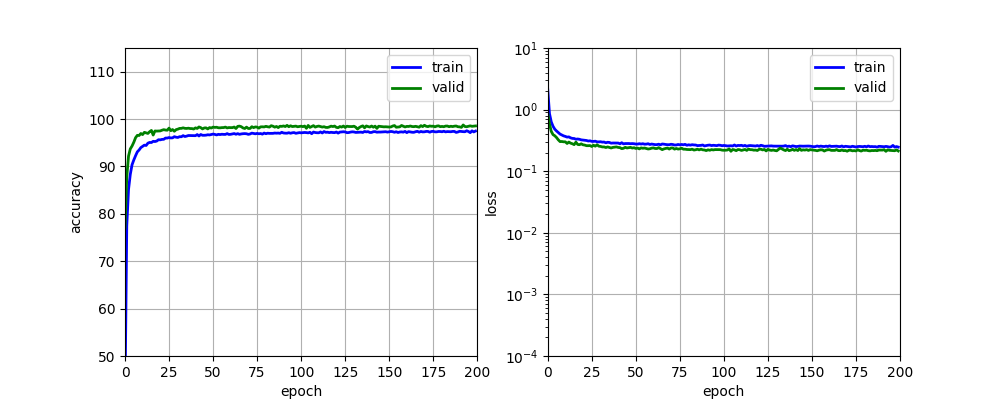
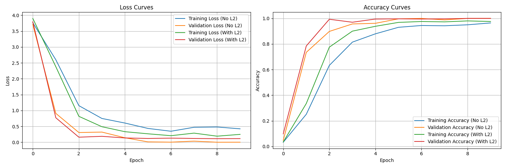

# Traffic Sign Classification CNN

This project implements a **Convolutional Neural Network (CNN)** to classify traffic signs from the **German Traffic Sign Recognition Benchmark (GTSRB)** dataset. The model is designed to recognize 43 traffic sign classes with high accuracy, leveraging data preprocessing, augmentation, and advanced training techniques.

**Links:**

- [Kaggle GTSRB Dataset](https://www.kaggle.com/datasets/meowmeowmeowmeowmeow/gtsrb-german-traffic-sign)  
- [Navoshta’s Traffic Sign Classification](https://navoshta.com/traffic-signs-classification/)  
- [Victor Zhou’s Intro to CNNs](https://victorzhou.com/blog/intro-to-cnns-part-1/)

---

## Features

- **Data Conversion:** Converts raw `.ppm` images into pickle files for efficient loading.
- **Data Preprocessing:** Grayscale conversion, histogram equalization, and normalization.
- **Data Augmentation:** Flipping and balancing techniques to address class imbalances.
- **CNN Architecture:** Customizable with 3 convolutional layers, max pooling, dropout, and fully connected layers.
- **Training Enhancements:** Early stopping, L2 regularization, and optional learning rate decay.
- **Prediction:** Classifies new images with top-5 prediction visualization.
- **Visualization Tools:** Dataset exploration, class distribution, preprocessing effects, augmentation samples, and t-SNE plots.

---

## Project Structure

- `convert_data.py`: Converts raw GTSRB `.ppm` images to pickle files (`train.p`, `test.p`).
- `data_loader.py`: Loads pickled data and traffic sign names from `signnames.csv`.
- `data_processor.py`: Preprocesses data (grayscale, equalization, normalization) and augments it (flipping, balancing).
- `model_builder.py`: Defines the CNN architecture with TensorFlow.
- `main.py`: Main script to run training or prediction modes with optional dataset rebuilding.
- `predictor.py`: Predicts traffic sign classes for custom images and visualizes results.
- `data_visualizer.py`: Visualizes dataset samples, class distribution, preprocessing, augmentation, and t-SNE.
- `trainer.py`: Manages model training with callbacks for checkpointing, logging, and early stopping.
- `requirements.txt`: Lists Python dependencies.
- `data/`: Contains raw images, `signnames.csv`, and pickle files (`train.p`, `test.p`, etc.).
- `models/`: Stores trained model weights and training logs.
- `utils/`: Includes `AugmentedSignsBatchIterator.py` for data augmentation.

---

## Installation

### Clone the Repository

```bash
git clone <repository-url>
cd TrafficSignClassificationCNN
```

### Recent Improvements

- **Enhanced L2 Regularization**: Applied L2 to all convolutional and dense layers (previously only on the final FC layer). See [L2_IMPROVEMENTS.md](L2_IMPROVEMENTS.md) for details.
- **Regularization Optimization**: Added scripts to find optimal L2 lambda values and test performance impacts.
- **Better Generalization**: Improved model's ability to generalize to unseen traffic signs.

### Install Dependencies

```bash
pip install -r requirements.txt
```

Ensure you have TensorFlow 2.x installed. For macOS with Apple Silicon, `tensorflow-macos` and `tensorflow-metal` are recommended for GPU support.

### Prepare the Dataset

1. Download the GTSRB dataset from [Kaggle](https://www.kaggle.com/datasets/meowmeowmeowmeowmeow/gtsrb-german-traffic-sign).
2. Place training images in `data/train/` (subfolders named by class ID, e.g., `00000`).
3. Place test images in `data/test/Images/`.
4. Ensure `signnames.csv` is in `data/`.

### Convert Data (optional)

```bash
python convert_data.py
```

This generates `data/train.p` and `data/test.p` from raw images.

---

## Usage

### Training the Model

Train the model with default settings:

```bash
python main.py --mode train
```

- Loads `train.p` and `test.p`.
- Preprocesses and balances the dataset (saved as `train_balanced.p`).
- Trains the CNN and saves weights in `models/`.

Use `--rebuild-datasets` to regenerate balanced datasets:

```bash
python main.py --mode train --rebuild-datasets
```

## Training Results

````
Result on training set
````
The following chart shows the model's learning curves during training:

*Left: Model accuracy for training and validation sets. Right: Model loss on logarithmic scale.*

```
With different l2 regularisation values 
```

*Left: Model loss on logarithmic scale. Right: Model accuracy for training and validation sets.*

### Predicting on New Images

Classify custom images:

```bash
python main.py --mode predict
```

- Place `.png` images in `data/custom/`.
- Outputs top-5 predictions with visualizations.

### Visualization Tools

Run `data_visualizer.py` to explore the dataset:

```bash
python data_visualizer.py
```

Options:

- **Random Samples:** View 10 random images from `train.p`.
- **Class Distribution:** Plot sample counts per class.
- **Preprocessing Comparison:** Compare original vs. preprocessed images.
- **Augmented Samples:** Show original vs. augmented images.
- **t-SNE Visualization:** Plot a 2D t-SNE projection of features.

Follow the prompts to select an option and specify parameters.

---

## Model Architecture

The CNN consists of:

| Layer    | Details                                      |
|----------|---------------------------------------------|
| Input    | 32×32×1 grayscale images                  |
| Conv1    | 5×5 kernel, 32 filters, ReLU, max pooling (2×2), 10% dropout |
| Conv2    | 5×5 kernel, 64 filters, ReLU, max pooling (2×2), 20% dropout |
| Conv3    | 5×5 kernel, 128 filters, ReLU, max pooling (2×2), 30% dropout |
| FC1      | 1024 units, ReLU, 50% dropout             |
| Output   | 43 units, softmax                         |


---

## Training Parameters

- **Learning Rate:** 0.001 (training), 0.0001 (prediction)
- **L2 Regularization:** Enabled (λ=0.0001)
- **Early Stopping:** Enabled (patience=100)
- **Batch Size:** 128
- **Max Epochs:** 200

---

## Data Preparation

- **Conversion:** `convert_data.py` resizes `.ppm` images to 32x32 and saves them as RGB pickle files.
- **Preprocessing:** Converts to grayscale, applies histogram equalization, and normalizes to [0,1].
- **Augmentation:**
  - **Flipping:** Extends dataset using horizontal/vertical flips for specific classes.
  - **Balancing:** Duplicates images with augmentation to balance classes (up to 2× original size).

---

## Requirements

See `requirements.txt`:
```
numpy
matplotlib
tensorflow-macos (or tensorflow for non-Mac)
tensorflow-metal (for Apple Silicon GPUs)
pandas
scikit-learn
scikit-image
seaborn
```
---

## Contributing

Contributions are welcome! Please:

1. Fork the repository.
2. Create a feature branch:

    ```bash
    git checkout -b feature/your-feature
    ```

3. Commit changes:

    ```bash
    git commit -m "Add your feature"
    ```

4. Push to the branch:

    ```bash
    git push origin feature/your-feature
    ```

5. Open a pull request.

---

## License

This project is licensed under the **MIT License**.

---

## Acknowledgments

- **GTSRB Dataset** for training and testing data.
- **TensorFlow, scikit-learn, and scikit-image** libraries.
- Inspiration from [Navoshta](https://navoshta.com/traffic-signs-classification/) and [Victor Zhou](https://victorzhou.com/blog/intro-to-cnns-part-1/).

---

## Notes on Changes

- **Updated Structure:** Reflects the actual files and their roles (e.g., added `convert_data.py`).
- **Clarified Usage:** Includes specific commands and dataset preparation steps.
- **Enhanced Details:** Model architecture and parameters align with `model_builder.py` and `trainer.py`.
- **Removed Email Notifications:** No evidence of this feature in the provided code (despite `config.json` mention).
- **Improved Visualization:** Matches options in `data_visualizer.py`.
- **Accurate Dependencies:** Matches `requirements.txt`.
